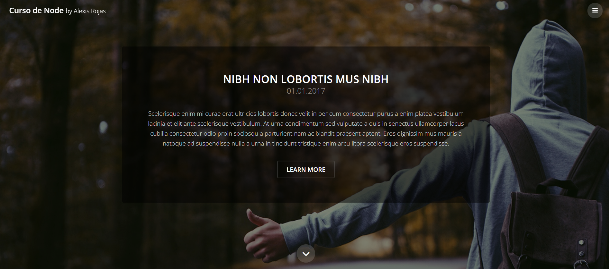
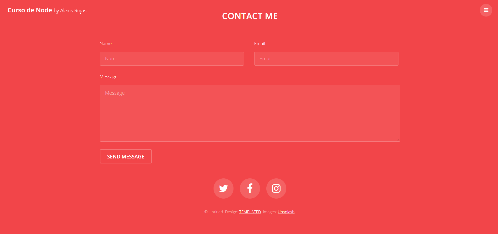

# webserver-NodeApp
This project was created with Node js using some libraries such as nodemon and express, in order to build a web server that allows to deploy static and dynamic web applications.

# Screenshots

